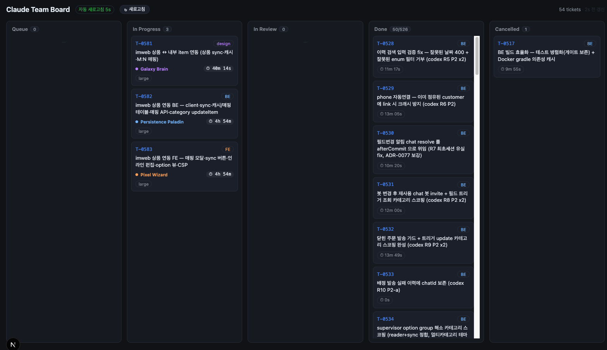
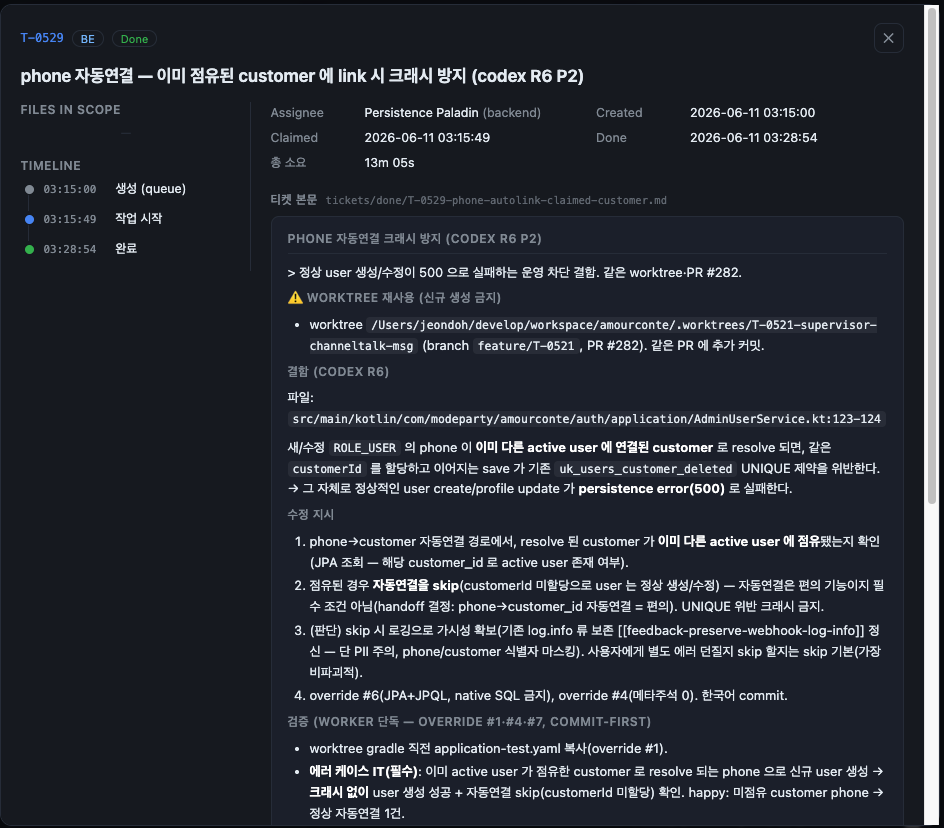

# Claude Team Board

**[personal-claude-code v2](https://github.com/sideholic/personal-claude-code-v2) 플러그인의 멀티 에이전트 작업을, 실시간 칸반 보드로.**

Technoking이 분해한 티켓을 Persistence Paladin·Pixel Wizard·Galaxy Brain 같은 페르소나 에이전트가 동시에 처리하는 흐름을 — **지금 누가, 무엇을, 얼마나 오래** 작업 중인지 한눈에 보여줍니다. 플러그인의 `.claude-team/` 폴더만 읽는 **완전한 read-only 뷰**라, 보드를 켜두어도 오케스트레이터의 작업에는 일절 영향을 주지 않습니다.



---

## ✨ 핵심 기능

### 📋 실시간 칸반 보드
`Queue → In Progress → In Review → Done → Cancelled` 5개 컬럼. **티켓 폴더(`tickets/<status>/`)가 곧 상태** — 플러그인이 파일을 옮기면 보드에 그대로 반영됩니다. `Done`처럼 누적이 많은 컬럼은 최근 항목만 보여주고 `50/526`처럼 총량을 함께 표기합니다.

### 🤖 실행 중인 에이전트 + 실행 시간
진행 중인 티켓 카드는 **어떤 에이전트가 붙어 있는지**(Galaxy Brain·Persistence Paladin·Pixel Wizard …)와 **실행 시간 `⏱ 4h 54m`** 를 1초 단위로 라이브 표시합니다. 완료된 티켓은 총 소요 시간을 보여줍니다.

### 🔄 폴더 기반 5초 폴링 + 수동 새로고침
SSE 이벤트 스트림 대신 **티켓 폴더 상태를 5초마다 폴링**해 진실에 가장 가깝게 동기화합니다. 상단의 **새로고침** 버튼으로 즉시 갱신할 수 있고, 마지막 갱신 시점(`2s 전 갱신`)을 항상 표시합니다.

### 🔎 티켓 상세 모달
카드를 클릭하면 좌측에 **Files in scope · Timeline**, 우측에 메타데이터(담당 에이전트·생성/완료 시각·소요 시간 등)와 **티켓 본문(`.md`) 전체**가 마크다운으로 예쁘게 렌더링됩니다.



### 🔒 Read-only by design
보드는 `.claude-team/` 아래 파일을 **읽기만** 합니다. 플러그인 상태를 쓰지 않고, 오케스트레이터를 깨우지 않습니다(v1 wake-channel 안티패턴 금지).

---

## 🚀 빠른 시작 (로컬)

```bash
pnpm install
EVENTS_LOG=/절대경로/대상프로젝트/.claude-team/events.jsonl pnpm dev
# → http://localhost:4317
```

`EVENTS_LOG`을 지정하지 않으면 `../personal-claude-code-v2/.claude-team/events.jsonl`을 기본으로 사용합니다. 이 경로의 **상위 디렉터리(`.claude-team`)** 가 보드가 읽는 루트가 됩니다.

## 🐳 Docker

```bash
docker build -t claude-board .
docker run -p 4317:4317 \
  -v /절대경로/대상프로젝트/.claude-team:/data/.claude-team:ro \
  claude-board
# → http://localhost:4317
```

> 보드가 티켓 폴더 전체를 읽으므로 `events.jsonl` 한 파일이 아니라 **`.claude-team` 디렉터리 전체**를 마운트합니다.

## ⚙️ 환경변수

| 변수 | 설명 | 기본값 |
|---|---|---|
| `EVENTS_LOG` | `.claude-team` 루트를 가리키는 앵커 경로(이 파일의 상위 폴더를 읽음) | `../personal-claude-code-v2/.claude-team/events.jsonl` |
| `PORT` | 서버 포트 | `4317` |

## 🧪 테스트

```bash
pnpm test   # vitest — 폴더/이벤트 reduce·frontmatter 파서 유닛 테스트
```

---

## 🧩 동작 원리

| 화면 | 데이터 소스 (API) | 내용 |
|---|---|---|
| 보드 카드 | `GET /api/board` | `tickets/<status>/*.md` 프런트매터 스캔 → 컬럼·담당 에이전트·시간 (5초 폴링) |
| 상세 본문 | `GET /api/ticket?id=…` | `.claude-team` 트리를 재귀 탐색해 티켓 `.md` 본문 반환 |
| (선택) 이벤트 | `GET /api/events` | `events.jsonl` SSE 스트림 — 이벤트 계약 호환용으로 유지(보드 미사용) |

**디렉터리 = 상태**가 원칙입니다. 플러그인이 티켓 파일을 `queue → in-progress → in-review → done`(또는 `cancelled`) 폴더로 옮기는 것이 곧 상태 전이이며, 보드는 그 폴더 구조를 그대로 렌더링합니다.

## 🛠 스택

Next.js 16 (App Router) · React 19 · TypeScript · Vitest. 보드 페이지 하나만 클라이언트 컴포넌트, 나머지는 서버 컴포넌트/Route Handler입니다.
